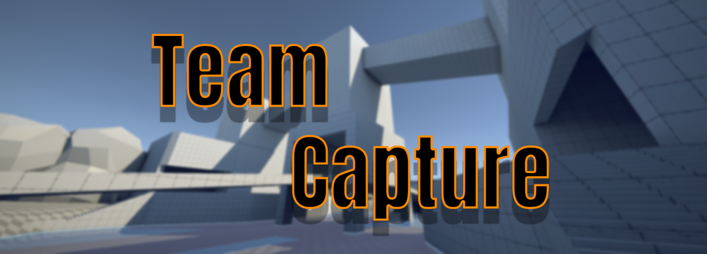
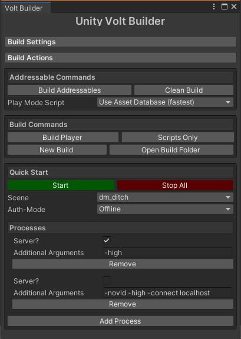

# Team-Capture
[](/LICENSE)
[](https://github.com/Voltstro-Studios/Team-Capture/actions)
[](https://discord.voltstro.dev) 
[](https://www.youtube.com/Voltstro)

**This project is in a very early alpha, a lot of things are either broken or buggy, not implemented, or are in the process of being implemented!**

Team-Capture is a multiplayer first person shooter game inspired by [Quake](https://store.steampowered.com/app/2310/QUAKE/), [Half-Life 2: Deathmatch](https://store.steampowered.com/app/320/HalfLife_2_Deathmatch/), [Team Fortress 2](http://www.teamfortress.com/) and a tf2 mod called [Open Fortress](https://www.openfortress.fun/) (aka "Boomer Shooters").

Team-Capture is still in very early development and is developed by a very small team! Expect bugs and other random stuff to occur while playing.

Team-Capture is built using the [Unity game engine](https://unity.com/), using [Mirror](https://mirror-networking.com) as it's netcode.

## Features

Please remember that this project is still in early development!

- In-Game Console
    - With commands!
- Working weapon shooting/reloading
- Working weapon switching
- Working pickups (Weapons/Health)
- Lag Compensation
- Server Auth Movement
- Dynamic settings UI
- Dynamic settings save system
- Discord Game RPC integration
- Steam integration
    - Steam Server Auth
- Server MOTDs (HTML or regular text)
- Full offline play
- Cross-platform play (Windows, Linux)
    - Both headless server and player
- Well documented API

For a roadmap of what is either being worked on, or planed to come, check out the [projects](https://github.com/Voltstro-Studios/Team-Capture/projects) tab.

### Unity Technologies Used

Unity has a lot of first-party packages, here are some that we use:

- [Addressables](https://docs.unity3d.com/Packages/com.unity.addressables@latest/manual/index.html)
- [Cinemachine](https://docs.unity3d.com/Packages/com.unity.cinemachine@latest/index.html)
- [Localization](https://docs.unity3d.com/Packages/com.unity.localization@latest/manual/index.html)
- [Input System](https://docs.unity3d.com/Packages/com.unity.inputsystem@latest/manual/index.html)
- [Universal Render Pipeline](https://docs.unity3d.com/Packages/com.unity.render-pipelines.universal@latest/manual/index.html)

We will usually always use whatever is the latest release version of a package for the current Unity version we are using.

## Team

Here is a list of people who work on the project:

* [Voltstro](https://github.com/Voltstro) - *Project Lead*

    - [Email](mailto:me@voltstro.dev) - [Website](https://voltstro.dev)

And here are some people who have worked on the project in the past:

* [EternalClickbait](https://github.com/EternalClickbait) - *Programmer*

* [HelloHowIsItGoing](https://github.com/HelloHowIsItGoing) - *Testing & Ideas*

If you think you can help out the team, please don't hesitate to email me (project lead)

## Getting the project

### Downloads

As this project is in an alpha state, a lot of things will constantly change, so it is recommended to build the project your self. We do also offer automatic ["Nightly" builds (DevOps)](https://nightly.link/Voltstro-Studios/Team-Capture/workflows/main/master).

We also upload [releases](https://github.com/Voltstro-Studios/Team-Capture/releases) every version milestone. The builds may be more stable then the DevOps builds but are still an early alpha and may lack new features and improvements that the DevOps builds have.

### Building

#### Prerequisites

```
Unity 2021.2.7f1
.NET 5+
```

### Pre-Setup

We first need to build Team-Capture's .NET Source generator, which as the name suggests is responsible for generating some TC specific code.

Open up [`src/Team-Capture.sln`](src/Team-Capture/Team-Capture.sln) in your IDE of choice and build the solution. The generator will be copied to the correct location on successful build. You can close the solution now and continue on.

#### Setup

Open up the project in Unity, and goto Tools **->** Volt Unity Builder **->** Volt Builder



1. Get use to Volt Builder, you are gonna need it. We suggest docking it somewhere for convenience.

2. Click 'Build Addressables'

3. Click 'Build Player'

    - Building for the first time may take awhile (30~ mins), once the cache is built it takes about 90~ secs. This all depends on your computer.

<br clear="left"/>

#### Launching the project

While working on the project, remember that if you alter code that runs on the server you will need to recompile the player build. You will need to also re-build the player build if you alter the scene in any major way.

To launch the player, click on 'Start' in Volt Builder. By default, two instances of the player should start, one being the server and the other is the client. The client will also connect automatically to the server. You can now run around and get some frags.

You can launch a build from the editor by going to Team-Capture **->** Build **->** Launch Player *etc*.

### Platform Support

Team-Capture plans to support most large x64-bit based desktop platforms.

|OS             |Client |Server |Notes                                                                                                                            |
|---------------|------ |------ |---------------------------------------------------------------------------------------------------------------------------------|
|Windows (x64)  |✔     |✔     |Native.                                                                                                                          |
|Linux (x64)    |✔     |✔     |Native. Some parts may require additional configuration. See [Linux Terminal](https://github.com/Voltstro-Studios/Team-Capture/wiki/Linux-Terminal) in the wiki for more info.|
|macOS (x64)    |✖     |✖     |No physical hardware to test or develop on.                                                                                      |

# License

This project is licensed under the GNU AGPLv3 License - see the [LICENSE](/LICENSE) file for details.

See [`thirdpartylegalcode.txt`](/thirdpartylegalcode.txt) and [`thirdpartylegalassets.txt`](/thirdpartylegalassets.txt) for third-party assets used.

# Q & A

**Q:** Is this a serious project?

**A:** Nah, this is just a hobby project that was originally started as a way to learn networking in Unity.

---

**Q:** Will this game be free when it comes out?

**A:** Team-Capture will always remain free and open-source.

---

**Q:** Why did you use the Unity game engine? Why not engine *x*?

**A:** At the start of this project, Unity seemed link an obvious choice, it was C# and we knew how to use it. Sometimes I regret that choice of sticking with it.

---

**Q:** Why not use [MLAPI](hhttps://github.com/Unity-Technologies/com.unity.netcode.gameobjects)?

**A:** When we started planning for this project, MLAPI was not apart of the Unity ecosystem. On top of that, at the time, MLAPI had really bad documentation, and a lack of community, so Mirror was the obvious chose. Now we are too far into development to change, not that we would.

# Special Thanks

To these projects:
- [Mirror](https://mirror-networking.com/) - Networking Code
- [FPSSample](https://github.com/Unity-Technologies/FPSSample) - Lots of code design inspiration, console backbone code and other stuff.

And to:
- Family
- Friends
- Other fellow students and staff at school for suggestions, ideas and bug hunting.
- And I suppose Unity, for both making an engine that is good but will drive you insane.

# Links

- [Website](https://tc.voltstro.dev)
- [Source Code Repo](https://github.com/Voltstro-Studios/Team-Capture)
- [Assets Source Repo](https://gitlab.com/Voltstro-Studios/TC/Team-Capture-Assets)